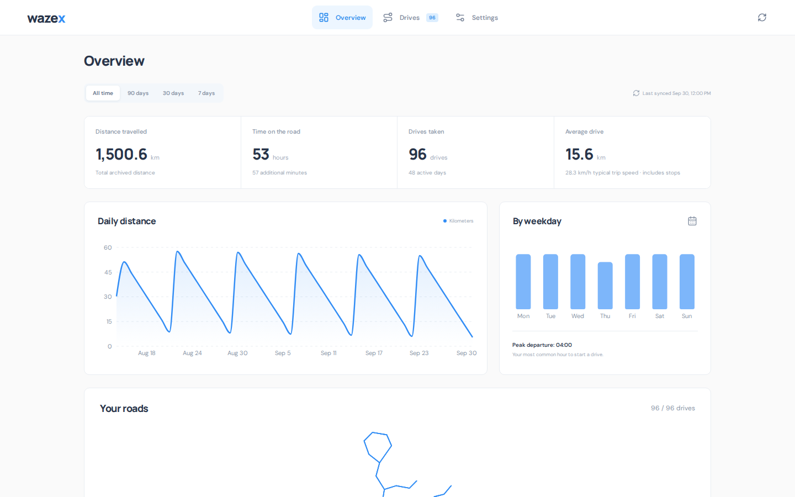
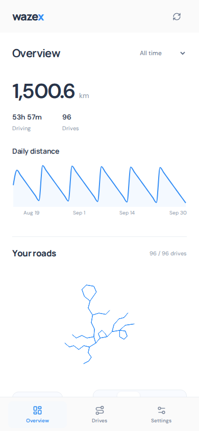

# wazex

## See where you've been.

Your Waze drives, all in one place. Browse past trips and explore your driving habits.

<table width="100%">
  <tr>
    <td width="78%" valign="top"></td>
    <td width="22%" valign="top"></td>
  </tr>
</table>

### Your drives at a glance

- **Browse your trips.** Search your history and see the distance, duration, and saved route for each drive.
- **Spot your patterns.** See how far you drive, when you drive most, and how your trips add up over time.
- **Watch your roads unfold.** Replay your saved routes as an animated network, at your own pace.
- **Keep your history.** Saved drives stay available after they disappear from Waze. Weekly sync keeps your archive growing.

Made for desktop and mobile, with light and dark themes. Export a backup whenever you need one.

## Get started

You'll need **Node.js 22.13+** and Waze on your phone.

```sh
npm install
npm run build
npm start
```

Open [wazex](http://127.0.0.1:4310), go to **Settings**, and connect Waze. Tap the QR code on your phone or scan it, then approve the connection. Your drives will start appearing automatically.

Keep wazex running for weekly sync. On Windows, `npm run start:local` runs it in the background.

## A few things to know

Unofficial and not affiliated with Waze. Only drives still available from Waze can be downloaded.

## Development

```sh
npm run dev
npm test
```

[MIT License](LICENSE)
